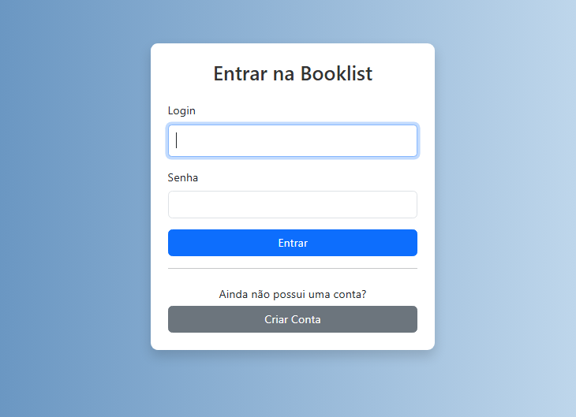
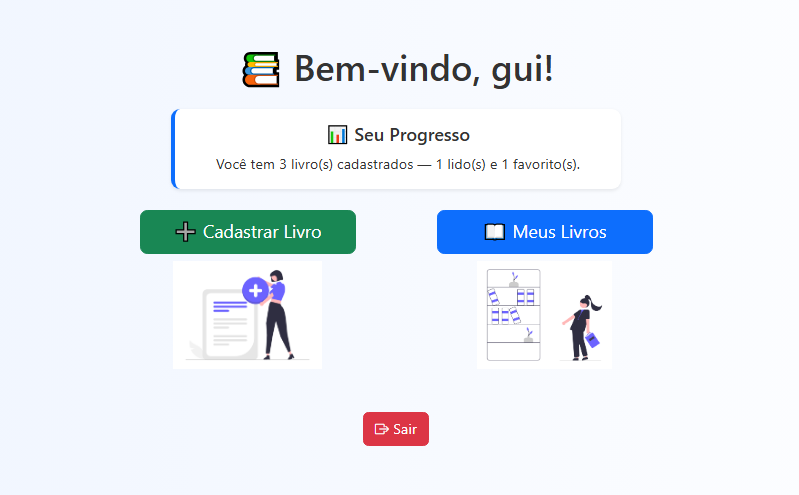
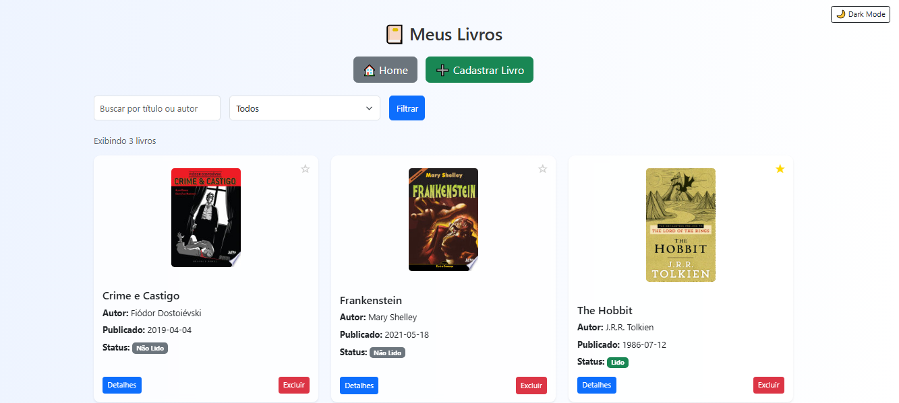

# 📚 Booklist com Integração à API do Google Books

Este proejto é baseado no meu último projeto booklist. Foram feitas melhorias nas telas, a introdução de um sistema de cadastro de usuário (permitindo que cada pessoa tenha sua própria estante de livros) e a integração com a API do Google Books, que permite buscar livros e preencher automaticamente os dados como título, autor, capa, descrição e data de publicação da edição. Um projeto web desenvolvido com Django que permite ao usuário cadastrar, visualizar e gerenciar sua lista de livros pessoais.


## 🖼️ Screenshots

###  Página Inicial


###  Login de Usuário


###  Home


###  Meus Livros



## 🚀 Funcionalidades

- Cadastro de livros manual ou por busca via API do Google Books
- Listagem de livros com visual moderno
- Visualização de detalhes
- Edição e exclusão de livros
- Marcar como "lido" e "favorito"
- Tema escuro com modo toggle
- Sistema de autenticação (login, logout e cadastro de usuário)


## 🛠️ Tecnologias Utilizadas

- Python 3.x
- Django 5.x
- HTML, CSS, JavaScript
- Bootstrap 5
- SQLite  
- Google Books API


## 📋 Pré-requisitos

Antes de começar, certifique-se de que você tem as seguintes ferramentas instaladas na sua máquina:

- 🧰 [Git](https://git-scm.com/downloads) — para clonar o repositório
- 🐍 [Python 3.x](https://www.python.org/downloads/) — para rodar o projeto (recomenda-se Python 3.10 ou superior)

💡 Você pode verificar se o Python e o Git estão instalados rodando `python --version` e `git --version` no terminal.


## 🚀 Como rodar o projeto localmente

### 1. Clone o repositório e navegue até o diretório do projeto

```bash
git clone https://github.com/Araujoo1/booklist_api.git
cd booklist_api
```

### 2. Crie um ambiente virtual

```bash
python -m venv venv 
```

### 3. Ative o ambiente virtual

No Windows:
```bash
venv\Scripts\activate
```

No Linux/macOS:
```bash
source venv/bin/activate
```

### 4. Instalar as dependências
```bash
pip install -r requirements.txt
```

### 5. Aplicar as migrações
```bash
python manage.py makemigrations
python manage.py migrate
```

### 6. Rodar o servidor
```bash
python manage.py runserver
```

### 7. Abrir o projeto na web
Agora é só ir em seu navegador e acessar http://127.0.0.1:8000/ 


## 👤 Autor

- **Guilherme Araujo** — [@Araujoo1](https://github.com/Araujoo1)